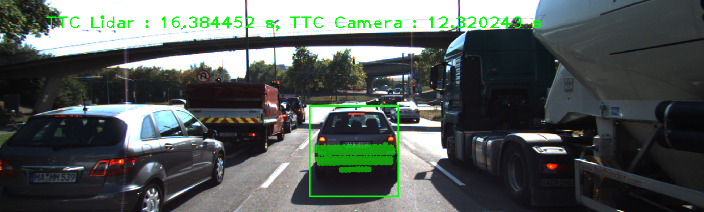
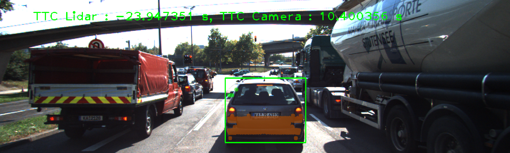
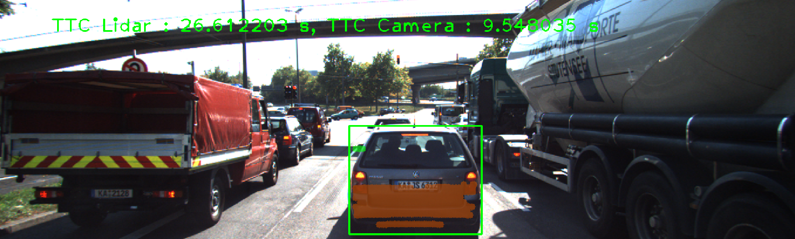
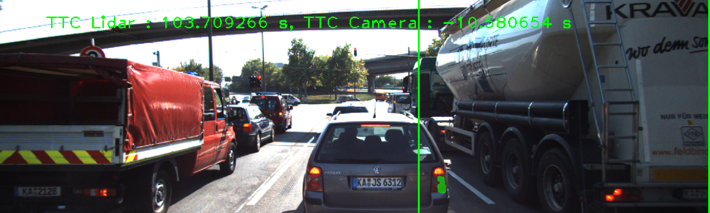
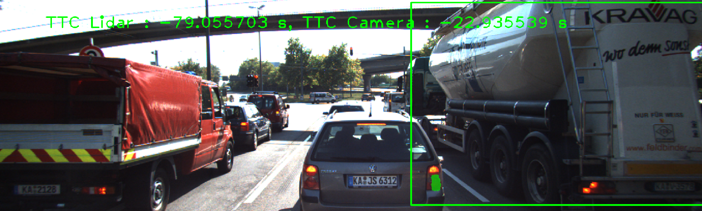
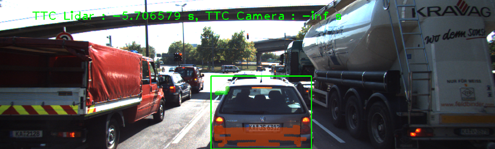

# SFND 3D Object Tracking

Welcome to the final project of the camera course. By completing all the lessons, you now have a solid understanding of keypoint detectors, descriptors, and methods to match them between successive images. Also, you know how to detect objects in an image using the YOLO deep-learning framework. And finally, you know how to associate regions in a camera image with Lidar points in 3D space. Let's take a look at our program schematic to see what we already have accomplished and what's still missing.


In this final project, you will implement the missing parts in the schematic. To do this, you will complete four major tasks: 
1. First, you will develop a way to match 3D objects over time by using keypoint correspondences. 
2. Second, you will compute the TTC based on Lidar measurements. 
3. You will then proceed to do the same using the camera, which requires to first associate keypoint matches to regions of interest and then to compute the TTC based on those matches. 
4. And lastly, you will conduct various tests with the framework. Your goal is to identify the most suitable detector/descriptor combination for TTC estimation and also to search for problems that can lead to faulty measurements by the camera or Lidar sensor. In the last course of this Nanodegree, you will learn about the Kalman filter, which is a great way to combine the two independent TTC measurements into an improved version which is much more reliable than a single sensor alone can be. But before we think about such things, let us focus on your final project in the camera course. 

## Dependencies for Running Locally
* cmake >= 2.8
  * All OSes: [click here for installation instructions](https://cmake.org/install/)
* make >= 4.1 (Linux, Mac), 3.81 (Windows)
  * Linux: make is installed by default on most Linux distros
  * Mac: [install Xcode command line tools to get make](https://developer.apple.com/xcode/features/)
  * Windows: [Click here for installation instructions](http://gnuwin32.sourceforge.net/packages/make.htm)
* OpenCV >= 4.1
  * This must be compiled from source using the `-D OPENCV_ENABLE_NONFREE=ON` cmake flag for testing the SIFT and SURF detectors.
  * The OpenCV 4.1.0 source code can be found [here](https://github.com/opencv/opencv/tree/4.1.0)
* gcc/g++ >= 5.4
  * Linux: gcc / g++ is installed by default on most Linux distros
  * Mac: same deal as make - [install Xcode command line tools](https://developer.apple.com/xcode/features/)
  * Windows: recommend using [MinGW](http://www.mingw.org/)

## Basic Build Instructions

1. Clone this repo.
2. Make a build directory in the top level project directory: `mkdir build && cd build`
3. Compile: `cmake .. && make`
4. Run it: `./3D_object_tracking`.

## Track an Object in 3D space

#### FP.1 Match 3D Objects

Implemented the method "matchBoundingBoxes", which took both the previous and the current data frames as input and provides the ids of the matched regions of interest (i.e. the boxID property) as output. Matches must be the ones with the highest number of keypoint correspondences.
```c++
void matchBoundingBoxes(std::vector<cv::DMatch> &matches, std::map<int, int> &bbBestMatches, DataFrame &prevFrame, DataFrame &currFrame)
{    
    int p = prevFrame.boundingBoxes.size();
    int c = currFrame.boundingBoxes.size();
    int pt_counts[p][c] = { };
    for (auto it = matches.begin(); it != matches.end() - 1; ++it)     {
        cv::KeyPoint query = prevFrame.keypoints[it->queryIdx];
        auto query_pt = cv::Point(query.pt.x, query.pt.y);
        bool query_found = false;
        cv::KeyPoint train = currFrame.keypoints[it->trainIdx];
        auto train_pt = cv::Point(train.pt.x, train.pt.y);
        bool train_found = false;
        std::vector<int> query_id, train_id;
        for (int i = 0; i < p; i++) {
            if (prevFrame.boundingBoxes[i].roi.contains(query_pt))             {
                query_found = true;
                query_id.push_back(i);
             }
        }
        for (int i = 0; i < c; i++) {
            if (currFrame.boundingBoxes[i].roi.contains(train_pt))             {
                train_found= true;
                train_id.push_back(i);
            }
        }
        if (query_found && train_found) 
        {
            for (auto id_prev: query_id)
                for (auto id_curr: train_id)
                     pt_counts[id_prev][id_curr] += 1;
        }
    }
   
    for (int i = 0; i < p; i++)
    {  
         int max_count = 0;
         int id_max = 0;
         for (int j = 0; j < c; j++)
             if (pt_counts[i][j] > max_count)
             {  
                  max_count = pt_counts[i][j];
                  id_max = j;
             }
          bbBestMatches[i] = id_max;
    } 
    bool bMsg = true;
    if (bMsg)
        for (int i = 0; i < p; i++)
             cout << "Box " << i << " matches " << bbBestMatches[i]<< " box" << endl;
}
```
#### FP.2 Compute Lidar-based TTC

Compute the time-to-collision in second for all matched 3D objects using only Lidar measurements from the matched bounding boxes between current and previous frame.
```c++
void computeTTCLidar(std::vector<LidarPoint> &lidarPointsPrev,
                     std::vector<LidarPoint> &lidarPointsCurr, double frameRate, double &TTC)
{		     
    double dT = 1 / frameRate;
    double laneWidth = 4.0; // assumed width of the ego lane
    vector<double> xPrev, xCurr;
    // find Lidar points within ego lane
    for (auto it = lidarPointsPrev.begin(); it != lidarPointsPrev.end(); ++it)
    {
        if (abs(it->y) <= laneWidth / 2.0)
        { // 3D point within ego lane?
            xPrev.push_back(it->x);
        }
    }
    for (auto it = lidarPointsCurr.begin(); it != lidarPointsCurr.end(); ++it)
    {
        if (abs(it->y) <= laneWidth / 2.0)
        { // 3D point within ego lane?
            xCurr.push_back(it->x);
        }
    }
    double minXPrev = 0; 
    double minXCurr = 0;
    if (xPrev.size() > 0)
    {  
       for (auto x: xPrev)
            minXPrev += x;
       minXPrev = minXPrev / xPrev.size();
    }
    if (xCurr.size() > 0)
    {  
       for (auto x: xCurr)
           minXCurr += x;
       minXCurr = minXCurr / xCurr.size();
    }  
    // compute TTC from both measurements
    cout << "minXCurr: " << minXCurr << endl;
    cout << "minXPrev: " << minXPrev << endl;
    TTC = minXCurr * dT / (minXPrev - minXCurr);
}
```
### FP.3 Associate Keypoint Correspondences with Bounding Boxes

Prepared the TTC computation based on camera measurements by associating keypoint correspondences to the bounding boxes which enclose them. All matches which satisfied this condition were added to a vector in the respective bounding box.

```c++
void clusterKptMatchesWithROI(BoundingBox &boundingBox, std::vector<cv::KeyPoint> &kptsPrev, std::vector<cv::KeyPoint> &kptsCurr, std::vector<cv::DMatch> &kptMatches)
{
    double dist_mean = 0;
    std::vector<cv::DMatch>  kptMatches_roi;
    for (auto it = kptMatches.begin(); it != kptMatches.end(); ++it)
    {
        cv::KeyPoint kp = kptsCurr.at(it->trainIdx);
        if (boundingBox.roi.contains(cv::Point(kp.pt.x, kp.pt.y))) 
            kptMatches_roi.push_back(*it);
     }   
    for  (auto it = kptMatches_roi.begin(); it != kptMatches_roi.end(); ++it)  
         dist_mean += it->distance; 
    cout << "Find " << kptMatches_roi.size()  << " matches" << endl;
    if (kptMatches_roi.size() > 0)
         dist_mean = dist_mean/kptMatches_roi.size();  
    else return;    
    double threshold = dist_mean * 0.7;        
    for  (auto it = kptMatches_roi.begin(); it != kptMatches_roi.end(); ++it)
    {
       if (it->distance < threshold)
           boundingBox.kptMatches.push_back(*it);
    }
    cout << "Leave " << boundingBox.kptMatches.size()  << " matches" << endl;
}    
```
### FP.4 Compute Camera-based TTC

Computed the time-to-collision in second for all matched 3D objects using only keypoint correspondences from the matched bounding boxes between current and previous frame.
```c++
void computeTTCCamera(std::vector<cv::KeyPoint> &kptsPrev, std::vector<cv::KeyPoint> &kptsCurr, 
                      std::vector<cv::DMatch> kptMatches, double frameRate, double &TTC, cv::Mat *visImg)
{
    vector<double> distRatios; // stores the distance ratios for all keypoints between curr. and prev. frame
    for (auto it1 = kptMatches.begin(); it1 != kptMatches.end() - 1; ++it1)
    {
        cv::KeyPoint kpOuterCurr = kptsCurr.at(it1->trainIdx);
        cv::KeyPoint kpOuterPrev = kptsPrev.at(it1->queryIdx);
       
        for (auto it2 = kptMatches.begin() + 1; it2 != kptMatches.end(); ++it2)
        {  
            double minDist = 100.0; // min. required distance
            cv::KeyPoint kpInnerCurr = kptsCurr.at(it2->trainIdx);
            cv::KeyPoint kpInnerPrev = kptsPrev.at(it2->queryIdx);
            // compute distances and distance ratios
            double distCurr = cv::norm(kpOuterCurr.pt - kpInnerCurr.pt);
            double distPrev = cv::norm(kpOuterPrev.pt - kpInnerPrev.pt);
            if (distPrev > std::numeric_limits<double>::epsilon() && distCurr >= minDist)
            { // avoid division by zero
                double distRatio = distCurr / distPrev;
                distRatios.push_back(distRatio);
            }
        }
    }  
    // only continue if list of distance ratios is not empty
    if (distRatios.size() == 0)
    {
        TTC = NAN;
        return;
    }
    std::sort(distRatios.begin(), distRatios.end());
    long medIndex = floor(distRatios.size() / 2.0);
    double medDistRatio = distRatios.size() % 2 == 0 ? (distRatios[medIndex - 1] + distRatios[medIndex]) / 2.0 : distRatios[medIndex];   // compute median dist. ratio to remove outlier influence

    double dT = 1 / frameRate;
    TTC = -dT / (1 - medDistRatio);
}    
```
### FP.5 Performance Evaluation 1

Examples of wrong TTC estimates for Lidar sensor:

IMAGE               | Description
--------------------| -------------------
 | TTC from Lidar was incorrect due to outliers and need to be fltered.
  | TTC from Lidar was negative because the estimation used mean of all Lidar points that return minXCurr > minXPrev. The Lidar points from front mirrors of the preceding vehicle must be deleted
 | TTC from Lidar was not correct due to outliers and some unstable points from preceding vehicle's front mirrors


#### 6. Performance Evaluation 2

Examples of wrong TTC estimates for Camera:

IMAGE               | Description
--------------------| -------------------
 | TTC estimate from Camera was negative due to the use of  vechicle points from right lane that returned minXCurr > minXPrev. The right lane points need to be deleted.
 | TTC estimate from Camera was negative due to the use of  vechicle points from right lane that returned minXCurr > minXPrev. The right lane points need to be deleted.
 | TTC from Camera is negative infinity because medDistRatio == 1. Need to delete right lane points and check medDistRatio to avoid division by zero.

In the code a loop was created to check all possible combinations of detectors and descriptors. The results were saved in a [Excel file](SFND_3D_Object_Tracking/Evaluation.xlsx)

The TOP3 detector / descriptor combinations were:
SHITOMASI/BRISK         
SHITOMASI/BRIEF            
SHITOMASI/ORB    